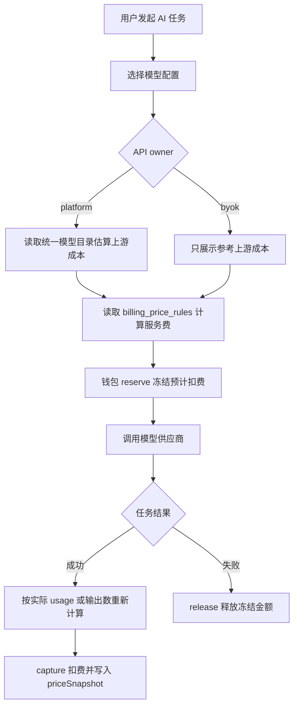

# 资金与计费架构

Haitu 的资金链路分成三层：统一模型目录、平台计费策略、钱包和支付结算。三层职责不同，不能混在一张表里维护。

## 设计结论

最优架构是“内置统一模型目录兜底 + 后台发布 active catalog + 平台服务费策略 + 钱包流水快照”。

- `src/modelPricing/officialModelPricingCatalog.ts` 是代码内置统一模型目录，负责新环境兜底和本地默认展示。
- 后台发布后的 `model_pricing_catalog_versions` 是线上 active catalog。模型价格页、模型配置可选版本和后端计费估算都应从同一份 active catalog 派生。
- 平台服务费只维护在 `billing_policies` 和 `billing_price_rules`，由后台 `/admin` 配置。
- 钱包充值和支付只负责让余额入账，不决定模型单价。
- 任务完成扣费时，钱包流水 metadata 写入当时的 `priceSnapshot`。后续官方价格变化，不影响历史账单解释。

## 核心公式

平台托管 key：

```text
钱包扣费 = Haitu 服务费 + 上游模型成本
```

用户 BYOK：

```text
钱包扣费 = Haitu 服务费
```

BYOK 的上游模型成本由用户自己的模型供应商账号承担，Haitu 只在预估页展示参考成本，不从钱包代扣。

## 请求链路



## 统一模型目录

`src/modelPricing/officialModelPricingCatalog.ts` 是模型版本事实源。它不是单独的“价格目录”，而是一份统一模型目录：每个模型版本同时包含 UI 展示信息、真实请求 `modelId`、运行时供应商、能力标签、默认启用建议、官方成本价和后端结算规则。

后台可基于它创建草稿并发布数据库版本。active catalog 的读取顺序是：

1. 数据库中 `published` 的模型目录版本；
2. 没有数据库发布版本时，使用内置 `officialModelPricingCatalog`。

目录包含：

- 模型配置字段：运行时 provider、vendor、真实 `modelId`、base URL、API mode、能力、任务范围、标签、默认启用建议。
- 价格页展示字段：供应商、模型、单位、输入价、缓存价、输出价、公式、示例和官方链接。
- 后端结算字段：规范模型名、别名、币种、计费单位、人民币单价、美元换算口径、图片按张价格、视频分辨率价格。

所有可配置、可计费的模型版本都必须在这份统一目录中同时具备 `catalog` 和 `settlement`。不再维护“只给 UI 用的模型目录”或“只给后端用的隐藏结算目录”。

前端 `src/client/modelPricingCatalog.ts` 只负责本地化和展示，不再定义模型或价格。后台模型价格页读取 `/api/admin/model-pricing-catalog`，保存草稿后再发布，不能“表格一改立即生效”。

后端 `src/server/modelPricing.ts` 只负责用共享目录计算：

- 文本 token 成本；
- 图片按张或图片 token 成本；
- 视频 token 成本；
- 结算价格快照。

`src/server/modelPricing.ts` 必须保持纯函数，不读数据库。`billingEstimateService`、`videoJobBilling`、`aiBilling`、视频任务队列和商品 AI 入口负责传入当前 active catalog。

## 钱包结算快照

`wallet_transactions.metadata.priceSnapshot` 记录任务扣费时的价格依据。快照至少包含：

- `catalogVersion`：模型目录版本日期；
- `model`：规范模型名；
- `requestedModel`：任务实际请求的模型 ID；
- `providerId`：供应商；
- `currency`：官方价格币种；
- `unit`：计费单位；
- `unitPriceCny` 或 token 单价字段；
- `sourceUrl`：官方价格来源。

这能解决两个问题：

- 价格页更新后，历史扣费仍能解释；
- 排查用户账单时，不需要猜当时用了哪份价格。

## 模块边界

模型计费模块负责“每次 AI 使用应该按哪个模型目录版本、什么官方成本和什么服务费扣”。详见 `docs/modules/model-pricing-billing.md`。

钱包支付模块负责“余额如何入账、冻结、扣除、释放和人工调整”。详见 `docs/modules/wallet-payments.md`。

模型服务模块负责“用平台 key 还是用户 BYOK key，以及选哪个模型配置”。详见 `docs/modules/model-service.md`。

## 不做的事

- 不在后台计费规则里维护上游模型官方单价。
- 不维护第二份模型清单；模型配置和模型计费必须共用统一模型目录。
- 不让充值订单决定 AI 任务扣费。
- 不用前端价格页的文案反推后端计费。
- 不修改历史钱包流水中的价格快照。
- 不把模型价格、Haitu 服务费、充值支付渠道放进同一个后台表单。它们分别属于“模型价格”“财务”“支付方式”。
