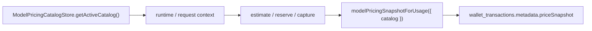

# 后台模型价格目录实现计划

> **给执行代理看的要求：** 实现本计划时必须使用 `superpowers:subagent-driven-development` 或 `superpowers:executing-plans`，逐项执行并更新下面的复选框。

**目标：** 让后台可以查看、校验、预览差异并版本化发布官方模型价格目录；发布后的价格只影响新的估算和新的任务扣费，历史钱包流水继续以 `priceSnapshot` 为准。

**架构：** `src/modelPricing/officialModelPricingCatalog.ts` 继续作为代码内置官方价格快照和兜底来源。新增服务端 `ModelPricingCatalogStore` 负责数据库版本、草稿、校验、差异预览和发布；计费纯函数不直接访问数据库，只接收调用层传入的 active catalog。后台把“模型官方价格目录”和“Haitu 服务费/充值支付”拆成两个模块，避免官方成本价和平台服务费混在一起。

**技术栈：** TypeScript、SQLite/better-sqlite3、Drizzle schema、React AdminApp、Vitest。

---

## 一、最终架构结论

1. 后台需要能看，也需要能改，但不能做成“表格里改完立即生效”。
2. 最优链路是：内置官方目录兜底 -> 后台创建草稿 -> 服务端校验 -> 后台展示差异 -> 发布新版本 -> 新估算和新任务读取新版本。
3. 后端扣费和模型价格页都必须从同一个 active catalog 派生，避免前后端两份价格。
4. 历史账单不回算、不更新。每笔钱包流水保留当时的 `metadata.priceSnapshot`，这是账单解释的最终依据。
5. 充值、支付渠道、Haitu 服务费是另一套“计费设置”；模型官方价格目录是“上游成本目录”。文档和后台页面都拆开。
6. 后台财务视图必须能查充值订单和消费流水明细，不只看余额汇总。运营需要能看到充值状态、支付渠道、消费类型、金额、任务 ID、价格快照和余额变化。
7. `/console` 是用户自己的工作台，只看自己的充值、消费、创作内容和模型设置；`/admin` 是全站运营后台，默认跨所有用户和工作区查看，并通过用户、工作区、时间、状态筛选。
8. 后台还负责全站配置：网站公开页配置、SEO/GEO 配置、支付方式、平台模型、官方模型价格、Haitu 服务费、系统运行状态和审计日志。
9. 后台能看全站业务数据，但不展示明文密钥、支付私钥和 webhook secret。敏感配置只展示配置状态、key preview、供应商 ID、最近更新时间和审计记录。

---

## 二、文件边界

- 新建 `src/server/modelPricingCatalogStore.ts`
  - 唯一负责读取内置目录、读取数据库已发布目录、保存草稿、生成差异、发布版本、校验目录。
  - 不包含 HTTP route 逻辑，不包含 UI view model。
- 新建 `src/server/adminModelPricingCatalog.ts`
  - 负责把 store 转成 admin API 的 response/request。
  - 包含差异预览格式、字段白名单和错误信息映射。
- 修改 `src/server/modelPricing.ts`
  - 保持纯函数。新增可选 `catalog?: readonly ModelPricingEntry[]` 入参。
  - 不 import 数据库，不 import store。
- 修改任务扣费入口：
  - `src/server/videoJobBilling.ts`
  - `src/server/aiBilling.ts`
  - `src/server/consoleVideoJobPersistence.ts`
  - 这些调用层负责传入当前 active catalog。
- 扩展后台财务查询：
  - `src/server/adminBilling.ts`
  - `src/server/walletRechargeOrderStore.ts`
  - 增加后台充值订单列表、钱包流水列表和按工作区筛选。
- 新增后台创作内容查询：
  - 新建 `src/server/adminContent.ts`
  - 查询所有用户/工作区的商品、视频任务、视频资产、故事板摘要。
- 新增后台站点配置查询：
  - 新建 `src/server/adminSiteSettings.ts`
  - 管理网站级配置、SEO/GEO 运营配置入口、公开页状态、支付/模型/计费配置入口摘要。
- 修改 runtime/server：
  - `src/server/consoleServerRuntime.ts`
  - `src/server/authAdminRoutes.ts`
  - 创建 `ModelPricingCatalogStore`，给 admin route 和计费入口使用。
- 修改数据库：
  - 新建 `src/server/db/migrations/0013_model_pricing_catalog_versions.sql`
  - 修改 `src/server/db/migrate.ts`
  - 修改 `src/server/db/schema.ts`
- 修改后台：
  - `src/client/AdminApp.tsx`
  - 如改动变大，拆出 `src/client/admin/AdminShell.tsx`
  - 如改动变大，拆出 `src/client/admin/AdminFinancePanel.tsx`
  - 如改动变大，拆出 `src/client/admin/AdminPaymentBillingPanel.tsx`
  - 如改动变大，拆出 `src/client/admin/AdminContentPanel.tsx`
  - 如改动变大，拆出 `src/client/admin/AdminModelPricingPanel.tsx`
  - 如改动变大，拆出 `src/client/admin/AdminSiteSettingsPanel.tsx`
  - 新增独立 section：`model-pricing`，不要塞进 Billing 面板。
- 修改文档：
  - `docs/architecture/billing-architecture.md`
  - `docs/modules/model-pricing-billing.md`
  - `docs/modules/wallet-payments.md`
  - 如已有后台模块文档，再更新 `docs/modules/admin.md`。

---

## 三、数据模型

新增两张表：

```sql
CREATE TABLE IF NOT EXISTS model_pricing_catalog_versions (
  id TEXT PRIMARY KEY,
  version TEXT NOT NULL,
  status TEXT NOT NULL CHECK (status IN ('published', 'archived')),
  catalog_json TEXT NOT NULL,
  source TEXT NOT NULL CHECK (source IN ('admin')),
  created_by TEXT,
  created_at TEXT NOT NULL,
  published_at TEXT NOT NULL
);

CREATE UNIQUE INDEX IF NOT EXISTS model_pricing_catalog_active_unique
ON model_pricing_catalog_versions(status)
WHERE status = 'published';

CREATE TABLE IF NOT EXISTS model_pricing_catalog_drafts (
  id TEXT PRIMARY KEY,
  base_version_id TEXT REFERENCES model_pricing_catalog_versions(id) ON DELETE SET NULL,
  version TEXT NOT NULL,
  catalog_json TEXT NOT NULL,
  created_by TEXT,
  created_at TEXT NOT NULL,
  updated_at TEXT NOT NULL
);

CREATE INDEX IF NOT EXISTS model_pricing_catalog_drafts_updated_idx
ON model_pricing_catalog_drafts(updated_at);
```

设计原则：

- `catalog_json` 保存完整目录快照，不只保存 diff。
- 同一时间最多一个 `published`。
- 发布事务里先 archive 旧版本，再插入新 published 版本。
- 草稿可以覆盖保存，但发布前必须重新校验。

---

## 四、实施任务

### Task 0：后台信息架构和壳层重排

**涉及文件：**

- 修改 `src/client/AdminApp.tsx`
- 视实现规模新建 `src/client/admin/AdminShell.tsx`
- 视实现规模新建 `src/client/admin/adminNavigation.ts`
- 修改 `src/i18n/locales/zh/app.json`
- 修改 `src/i18n/locales/en/app.json`
- 新建或修改测试 `tests/client/adminAppSource.test.ts`

**最终导航：**

- 总览：全站指标、增长、活跃、收入、生成任务概况。
- 用户与工作区：所有用户、工作区、成员、用户详情抽屉。
- 内容与创作：所有商品、视频任务、视频资产、故事板摘要，支持按用户/工作区/状态/时间筛选。
- 财务：所有钱包余额、充值订单、消费流水、人工调账、支付方式、Haitu 服务费。
- 模型配置：平台自带模型 API、模型 bundle、默认模型策略。
- 模型价格：官方模型价格目录、草稿、差异预览、发布历史。
- 网站配置：公开页、SEO/GEO、法律/退款/联系页状态、站点开关。
- 系统与审计：系统状态、后台操作日志、webhook 处理记录。

**布局原则：**

- 左侧导航按运营心智分组，不按代码模块堆菜单。
- 顶部固定上下文栏：当前 section、全局搜索、时间范围、刷新、管理员账号。
- 主区使用密集但清晰的数据表，不做营销式大卡片。
- 详情使用右侧抽屉：用户详情、工作区详情、钱包流水详情、视频任务详情、价格差异详情都复用同一模式。
- 财务和内容列表默认全站视角；选择工作区后下钻，不跳到用户控制台。
- 所有后台写操作都要有确认、审计日志和明确状态反馈。
- 敏感配置只显示是否已配置和脱敏预览；需要重填时走覆盖保存，不提供明文读取。

**步骤：**

- [ ] 写 source test：确认 `AdminSection` 包含 `overview`、`users`、`content`、`finance`、`model-services`、`model-pricing`、`site-settings`、`system`。
- [ ] 写 source test：确认后台 shell 有全局时间范围/搜索/刷新入口。
- [ ] 重命名现有 `billing` 导航为 `finance`，其中保留支付方式、服务费、钱包和人工调账。
- [ ] 重命名现有 `platform-models` 导航为 `model-services`，语义上专指平台模型配置。
- [ ] 新增 `content`、`model-pricing`、`site-settings` 三个一级 section。
- [ ] 如 `AdminApp.tsx` 继续超过 2500 行，将壳层、导航和新增面板拆到 `src/client/admin/`，避免一个文件继续膨胀。
- [ ] 补齐中英文 i18n。
- [ ] 运行 `npm test -- tests/client/adminAppSource.test.ts`。

### Task 1：数据库迁移和 schema

**涉及文件：**

- 新建 `src/server/db/migrations/0013_model_pricing_catalog_versions.sql`
- 修改 `src/server/db/migrate.ts`
- 修改 `src/server/db/schema.ts`
- 修改测试 `tests/server/db.test.ts`

**步骤：**

- [ ] 在 `tests/server/db.test.ts` 加断言：迁移后存在 `model_pricing_catalog_versions` 和 `model_pricing_catalog_drafts`。
- [ ] 运行 `npm test -- tests/server/db.test.ts`，确认失败。
- [ ] 新增 migration SQL，包含两张表、唯一 published index、draft updated index。
- [ ] 在 `src/server/db/migrate.ts` 注册 `0013_model_pricing_catalog_versions`。
- [ ] 在 `src/server/db/schema.ts` 增加 Drizzle 表定义并导出。
- [ ] 运行 `npm test -- tests/server/db.test.ts`，确认通过。

### Task 2：Catalog store

**涉及文件：**

- 新建 `src/server/modelPricingCatalogStore.ts`
- 新建测试 `tests/server/modelPricingCatalogStore.test.ts`

**核心接口：**

```ts
export interface ActiveModelPricingCatalog {
  id?: string;
  version: string;
  source: "built_in" | "database";
  catalog: ModelPricingEntry[];
  publishedAt?: string;
}

export interface ModelPricingCatalogDiff {
  added: ModelPricingEntry[];
  removed: ModelPricingEntry[];
  changed: Array<{
    model: string;
    before: ModelPricingEntry;
    after: ModelPricingEntry;
    changedFields: string[];
  }>;
}

export class ModelPricingCatalogStore {
  getActiveCatalog(): ActiveModelPricingCatalog;
  getDraft(draftId: string): ModelPricingCatalogDraft | undefined;
  saveDraft(input: SaveDraftInput): ModelPricingCatalogDraft;
  diffDraft(draftId: string): ModelPricingCatalogDiff;
  publishDraft(input: PublishDraftInput): ActiveModelPricingCatalog;
}
```

**步骤：**

- [ ] 写测试：无数据库发布版本时返回 `officialModelPricingCatalog`，source 为 `built_in`。
- [ ] 写测试：保存草稿后可以生成 added/removed/changed diff。
- [ ] 写测试：发布草稿后 active catalog source 为 `database`，旧版本被 archive。
- [ ] 写测试：负数价格、缺 provider/model/sourceUrl、空 catalog 会被拒绝。
- [ ] 实现 store。所有数据库写入必须在 publish 时使用事务。
- [ ] 运行 `npm test -- tests/server/modelPricingCatalogStore.test.ts`。

### Task 3：计费纯函数支持注入 catalog

**涉及文件：**

- 修改 `src/server/modelPricing.ts`
- 修改测试 `tests/server/modelPricing.test.ts`

**原则：**

- `src/server/modelPricing.ts` 不读数据库。
- `modelPricingSnapshotForUsage`、视频 token 单价计算、图片/文本估算都支持传入 `catalog`。
- 未传 `catalog` 时继续使用内置目录，作为兜底和测试默认行为。

**步骤：**

- [ ] 写测试：给 `modelPricingSnapshotForUsage` 注入一份改变后的视频价格目录，返回的新 `unitPriceCny` 使用注入价格。
- [ ] 写测试：未传 catalog 时仍使用内置目录。
- [ ] 修改 `ModelPricingSnapshotInput`，三个 usage 分支都增加 `catalog?: readonly ModelPricingEntry[]`。
- [ ] 增加内部 helper `pricingEntryForModel(model, catalog)`。
- [ ] 替换直接调用 `modelPricingEntryForModel` 的计算点。
- [ ] 运行 `npm test -- tests/server/modelPricing.test.ts`。

### Task 4：新任务扣费链路接入 active catalog

**涉及文件：**

- 修改 `src/server/videoJobBilling.ts`
- 修改 `src/server/aiBilling.ts`
- 修改 `src/server/consoleVideoJobPersistence.ts`
- 修改 `src/server/consoleServerRuntime.ts`
- 修改测试：
  - `tests/server/videoBillingReservation.test.ts`
  - `tests/server/videoBillingSettlement.test.ts`
  - `tests/server/billingEstimates.test.ts`

**链路：**



**步骤：**

- [ ] 给 reserve/capture/AI billing 入口增加 `modelPricingCatalog?: readonly ModelPricingEntry[]`。
- [ ] runtime 创建 store，并在新估算、新任务 reserve、新任务 capture 时传 active catalog。
- [ ] 确保已经写入的 `priceSnapshot` 不会因后台发布新版本而变化。
- [ ] 写测试：发布新目录后，新估算使用新价格。
- [ ] 写测试：已有钱包流水 metadata 中的旧 snapshot 保持不变。
- [ ] 运行相关 server tests。

### Task 5：Admin API

**涉及文件：**

- 新建 `src/server/adminModelPricingCatalog.ts`
- 修改 `src/server/authAdminRoutes.ts`
- 新建测试 `tests/server/adminModelPricingCatalog.test.ts`
- 修改测试 `tests/server/consoleApi.test.ts`

**API：**

- `GET /api/admin/model-pricing-catalog`
  - 返回 active catalog、版本、来源、最新草稿摘要。
- `PUT /api/admin/model-pricing-catalog/draft`
  - 保存草稿，服务端校验完整目录。
- `GET /api/admin/model-pricing-catalog/draft/:id/diff`
  - 返回草稿相对 active/base 的差异。
- `POST /api/admin/model-pricing-catalog/publish`
  - 发布草稿，写 audit log。

**步骤：**

- [ ] 写测试：admin 可以读取内置 active catalog。
- [ ] 写测试：保存草稿返回 draft id。
- [ ] 写测试：diff 能展示 changed model 和字段。
- [ ] 写测试：发布后再次 GET 返回 database source。
- [ ] 接入 admin routes 和 audit log。
- [ ] 运行 `npm test -- tests/server/adminModelPricingCatalog.test.ts tests/server/consoleApi.test.ts`。

### Task 6：后台财务明细 API

**涉及文件：**

- 修改 `src/server/adminBilling.ts`
- 修改 `src/server/authAdminRoutes.ts`
- 新建或修改测试 `tests/server/adminBilling.test.ts`
- 修改测试 `tests/server/consoleApi.test.ts`

**API：**

- `GET /api/admin/wallets`
  - 保持现有余额汇总：工作区、用户、余额、冻结金额、可用金额、流水数、最后流水。
- `GET /api/admin/wallet-transactions?workspaceId=&limit=&cursor=`
  - 返回钱包流水明细：充值、预扣、扣费、释放、退款、人工调整、赠送。
  - 每条包括金额、余额变化、冻结变化、任务 ID、reservation ID、说明、metadata、`priceSnapshot`。
- `GET /api/admin/recharge-orders?workspaceId=&status=&provider=&limit=&cursor=`
  - 返回充值订单：支付渠道、订单状态、支付金额、入账金额、provider session/payment intent、失败原因、创建/完成时间。

**步骤：**

- [ ] 写测试：后台能按工作区列出钱包流水，包含 `charge` 流水的 `metadata.priceSnapshot`。
- [ ] 写测试：后台能列出充值订单，并按 status/provider 过滤。
- [ ] 实现 `listAdminWalletTransactions`，默认最近 100 条，最大 500 条。
- [ ] 实现 `listAdminRechargeOrders`，默认最近 100 条，最大 500 条。
- [ ] 接入 `authAdminRoutes.ts`，所有接口必须 admin 鉴权。
- [ ] 运行 `npm test -- tests/server/adminBilling.test.ts tests/server/consoleApi.test.ts`。

### Task 7：后台内容与创作 API

**涉及文件：**

- 新建 `src/server/adminContent.ts`
- 修改 `src/server/authAdminRoutes.ts`
- 新建测试 `tests/server/adminContent.test.ts`
- 修改测试 `tests/server/consoleApi.test.ts`

**API：**

- `GET /api/admin/content/summary`
  - 返回全站商品数、视频任务数、成功/失败/运行中任务数、视频资产数。
- `GET /api/admin/content/video-jobs?workspaceId=&userId=&status=&from=&to=&limit=&cursor=`
  - 返回所有视频任务，关联工作区、用户、商品 SKU、模型、状态、费用、创建/完成时间。
- `GET /api/admin/content/products?workspaceId=&userId=&query=&limit=&cursor=`
  - 返回所有商品摘要，关联工作区、用户、SKU、标题、资产数、视频任务数。

**步骤：**

- [ ] 写测试：后台能跨工作区列出视频任务，并包含 owner email 和 workspace name。
- [ ] 写测试：后台能按 status/workspaceId 过滤视频任务。
- [ ] 写测试：后台能列出商品摘要，并按 query 搜索 SKU/标题。
- [ ] 实现 `adminContent.ts` 查询函数，默认最近 100 条，最大 500 条。
- [ ] 接入 `authAdminRoutes.ts`，所有接口必须 admin 鉴权。
- [ ] 运行 `npm test -- tests/server/adminContent.test.ts tests/server/consoleApi.test.ts`。

### Task 8：后台网站配置 API

**涉及文件：**

- 新建 `src/server/adminSiteSettings.ts`
- 修改 `src/server/authAdminRoutes.ts`
- 新建测试 `tests/server/adminSiteSettings.test.ts`
- 修改文档 `docs/modules/admin.md`

**范围：**

- 读取网站级配置摘要：公开页状态、默认语言、默认视频参数、支付方式状态、SEO/GEO roadmap 文档路径。
- 第一版不把所有静态页面内容都做成 CMS；只给后台配置入口和状态视图，避免过早做复杂内容管理系统。

**API：**

- `GET /api/admin/site-settings`
  - 返回站点配置摘要、公开页状态、SEO/GEO 文档路径、默认 console 设置。

**步骤：**

- [ ] 写测试：后台能读取 site settings summary。
- [ ] 实现 `buildAdminSiteSettingsSummary`。
- [ ] 接入 `authAdminRoutes.ts`。
- [ ] 更新后台模块文档，说明网站配置第一版是“状态和入口”，不是 CMS。
- [ ] 运行 `npm test -- tests/server/adminSiteSettings.test.ts tests/server/consoleApi.test.ts`。

### Task 9：后台 UI

**涉及文件：**

- 修改 `src/client/AdminApp.tsx`
- 修改 `src/i18n/locales/zh/app.json`
- 修改 `src/i18n/locales/en/app.json`
- 新建测试 `tests/client/adminModelPricingCatalogSource.test.ts`
- 修改测试 `tests/client/adminAppSource.test.ts`

**UI 要求：**

- 按 Task 0 的信息架构重排后台导航。
- 新增独立导航项：`模型价格`，不要放到财务里。
- 新增独立导航项：`内容与创作`，查看所有用户/工作区的商品、视频任务和资产摘要。
- 新增独立导航项：`网站配置`，查看网站公开页、SEO/GEO、默认设置和配置入口。
- 顶部展示 active 版本、来源、发布时间。
- 表格展示 provider、model、kind、计价单位、官方来源链接、当前人民币价格。
- 编辑区支持完整目录草稿保存；第一版可以用结构化表格编辑核心价格字段，同时保留 JSON 高级编辑入口，避免字段覆盖不完整。
- 保存草稿后必须展示差异预览。
- 发布按钮只有在 diff 已加载且校验通过时可点。
- Billing/财务区域展示余额汇总、充值订单列表、消费流水列表。点某个工作区时可以筛选该工作区的充值和流水。
- 消费流水里要能展开查看 `priceSnapshot`，用于解释模型官方价、平台服务费和最终扣费。
- 页面文案中文优先，英文 locale 同步补齐。

**步骤：**

- [ ] 写 source test：确认 `AdminSection` 包含 `model-pricing`。
- [ ] 写 source test：确认模型价格目录调用四个 API：GET active、PUT draft、GET diff、POST publish。
- [ ] 写 source test：确认财务区域调用 `/api/admin/wallet-transactions` 和 `/api/admin/recharge-orders`。
- [ ] 写 source test：确认内容区域调用 `/api/admin/content/summary`、`/api/admin/content/video-jobs`、`/api/admin/content/products`。
- [ ] 写 source test：确认网站配置区域调用 `/api/admin/site-settings`。
- [ ] 增加 Admin types/state/load/save/diff/publish 逻辑。
- [ ] 新增 `AdminModelPricingCatalogPanel`。
- [ ] 扩展 `AdminFinancePanel`，增加充值订单表和钱包流水表；支付方式和服务费留在 `AdminPaymentBillingPanel`。
- [ ] 新增 `AdminContentPanel`，显示全站创作内容列表和详情抽屉。
- [ ] 新增 `AdminSiteSettingsPanel`，显示网站配置状态和入口。
- [ ] 补齐中英文 i18n。
- [ ] 运行 `npm test -- tests/client/adminModelPricingCatalogSource.test.ts tests/client/adminAppSource.test.ts`。

### Task 10：文档更新

**涉及文件：**

- 修改 `docs/architecture/billing-architecture.md`
- 修改 `docs/modules/model-pricing-billing.md`
- 修改 `docs/modules/wallet-payments.md`
- 如存在则修改 `docs/modules/admin.md`

**内容：**

- 架构文档说明：内置目录兜底、数据库发布版本优先、纯函数注入 catalog。
- 模块文档说明：模型价格目录只维护上游官方成本，Haitu 服务费在 Billing 设置维护。
- 钱包支付文档说明：扣费依据是任务创建/结算时保存的 `priceSnapshot`，历史流水不随新目录变化；后台可以查充值订单和钱包流水明细。
- 后台模块文档说明：`/admin` 是全站运营后台，能跨用户/工作区查看财务、创作内容和配置；`/console` 是用户个人工作台。
- 标明 `seo-geo-roadmap` 的新位置不受本次变更影响，继续保留长期 roadmap。

**步骤：**

- [ ] 更新文档。
- [ ] 运行 docs markdown 链接检查。
- [ ] 确认所有新增文档内容为中文。

### Task 11：最终验证

**步骤：**

- [ ] 运行定向测试：

```bash
npm test -- tests/server/modelPricingCatalogStore.test.ts tests/server/adminModelPricingCatalog.test.ts tests/server/modelPricing.test.ts tests/server/videoBillingReservation.test.ts tests/server/videoBillingSettlement.test.ts tests/server/billingEstimates.test.ts tests/server/adminBilling.test.ts tests/server/adminContent.test.ts tests/server/adminSiteSettings.test.ts tests/client/adminModelPricingCatalogSource.test.ts tests/client/adminAppSource.test.ts
```

- [ ] 运行全量测试：

```bash
npm test
```

- [ ] 运行类型检查：

```bash
npm run typecheck
```

- [ ] 运行前端构建：

```bash
npm run build:console
```

---

## 五、落地顺序

推荐按下面顺序做：

1. 先做 DB 和 store，保证“版本化目录”本身可靠。
2. 再做纯计费函数注入 catalog，保证架构边界干净。
3. 再接新任务扣费链路，保证发布后的价格真正生效。
4. 再做 admin API/UI，避免前端先行导致后端模型不稳。
5. 最后补文档和全量验证。

---

## 六、风险控制

- 不直接修改历史 `wallet_transactions.metadata.priceSnapshot`。
- 不删除 `officialModelPricingCatalog.ts`，它是兜底和可审计基线。
- 不把模型官方价和 Haitu 服务费合并成一个后台表单。
- 不让 `src/server/modelPricing.ts` 读数据库。
- 不做“发布即影响正在运行中的旧任务”的回溯逻辑；旧任务按创建/预扣时的 snapshot 解释。

---

## 七、自审

- 覆盖后台查看：Task 5、Task 6。
- 覆盖后台修改：Task 2、Task 5、Task 6。
- 覆盖版本化发布：Task 2、Task 5。
- 覆盖前后端共用价格源：Task 3、Task 4。
- 覆盖历史账单不变：Task 4、Task 7。
- 覆盖文档：Task 7。
- 文档为中文，只有代码路径、命令、接口名保留英文。
